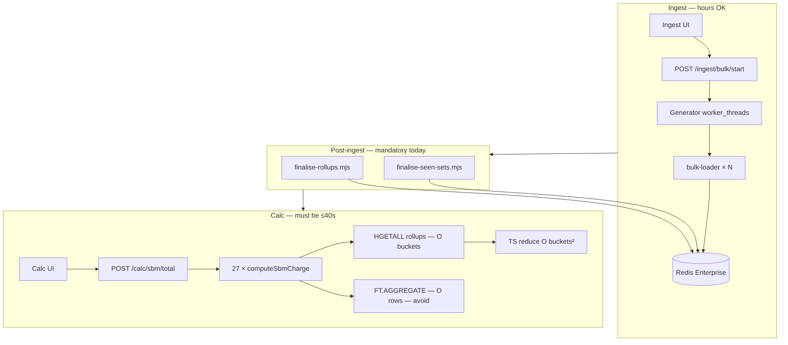
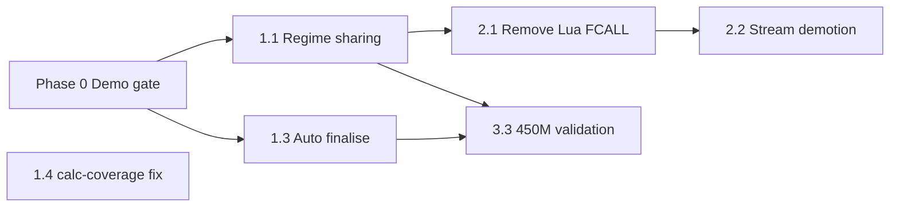

# Optimization & cleanup roadmap

> **Purpose:** A phased plan to make 400M-row Enterprise demos reliable (calc ≤40s),
> remove legacy complexity, and keep the codebase maintainable.
>
> **Audience:** Engineers preparing ingest/calc demos and follow-on hardening.
> **Related:** [docker-deploy.md](./docker-deploy.md) · [cleanup-audit-2026-06-18.md](./cleanup-audit-2026-06-18.md) · [presenter-checklist.md](./presenter-checklist.md)

---

## Goals

| Goal | Success metric |
|------|----------------|
| **Demo calc latency** | Cold `POST /calc/sbm/total` ≤ **40s** on 400M rows after ingest |
| **Demo repeat latency** | Warm calc (cache hit) ≤ **2s** wall clock |
| **No silent slow path** | Calc uses **rollup (HGETALL)** engine, not FT.AGGREGATE over full index |
| **Ingest at scale** | 400M bulk ingest completes without sustained 429/503 storms |
| **Maintainability** | Remove dead Lua FCALL path; shrink largest monolith files |

---

## Current architecture (what we're optimising)



**Complexity today (dominant terms):**

| Path | Per calc cell | Total SBM (27 cells) |
|------|---------------|----------------------|
| Rollups present | O(B×T) Redis + O(B²) TS | O(27×B×T) — **acceptable** |
| Rollups missing | O(N) Redis scan | O(27×N) — **fails at 400M** |

B = buckets (~10–100), T = GIRR tenors (~10), N = rows (400M).

---

## Phase 0 — Demo gate (do before going live)

**Timeline:** Day before + morning of demo  
**Risk if skipped:** Calc minutes/hours; timeouts → HTTP 500; audience sees red badges.

### 0.1 Environment

- [ ] Redis Enterprise cluster sized for ~800 GB row estimate + indexes + rollups/seen keys
- [ ] `proxy_policy=all-master-shards` on connection profile
- [ ] Launch: `scripts/docker-up.sh --scale 400m --build`
- [ ] Confirm api env: `POOL_COMMAND_TIMEOUT_HEAVY_CALC_MS=180000`, `RUNTIME_REDIS_POOL_SIZE_HEAVY_CALC=8`, `CALC_LAZY_MATH=1`, `ENABLE_SLIM_SENS_INDEX=1`

### 0.2 Ingest

- [ ] Use **400M** preset (or custom `400_000_000` rows), workers **4–8**
- [ ] Monitor bulk-loader 429 / ingest panel backpressure; reduce workers if throttled
- [ ] Do **not** start calc demo until ingest is fully terminal

### 0.3 Post-ingest finalisation (mandatory)

```bash
node --env-file=.env.local scripts/finalise-rollups.mjs
node --env-file=.env.local scripts/finalise-seen-sets.mjs
```

- [ ] Rollups materialise per-bucket sums compatible with calc rollup path
- [ ] `seen:bucket:*` sets populated for O(B) discovery

### 0.4 Calc validation

- [ ] Cold run: `POST /calc/sbm/total?nocache=1` — record `wall_clock_ms`, expect ≤40s
- [ ] Warm run: repeat without `nocache` — expect cache hits, ≤2s
- [ ] Spot-check response: `engine` / per-cell metadata shows **rollup**, not `ft_aggregate`
- [ ] Optional: `node --env-file=.env.local scripts/demo-prep-check.mjs` (add coverage timeout if script blocks)

### 0.5 Presenter hygiene

- [ ] Run once through [presenter-checklist.md](./presenter-checklist.md) calc sections
- [ ] Pre-warm total calc before audience; use warm repeat for live click
- [ ] Fallback assets ready if cluster/network flakes (see checklist fallback tree)

**Exit criteria:** One documented cold + warm calc timing on the target cluster, rollup path confirmed.

---

## Phase 1 — Accuracy-preserving performance (P1, ~1–2 weeks)

These changes **do not alter Basel math**; they reduce redundant work or RTTs.

### 1.1 Share fan-out across correlation regimes (high impact)

**Problem:** `/calc/sbm/total` runs 27 full `computeSbmCharge` calls. Regime (low/medium/high) only scales γ in the **reduce** step after fan-out — bucket K_b/S_b are identical per `(risk_class, leg)`.

**Change:**

- Split `computeSbmCharge` into **fan-out** (Redis) and **reduce** (TS)
- Orchestrator: 9 fan-outs (3 classes × 3 legs) → 3 reduces each for low/medium/high
- **Expected gain:** ~**3×** less Redis work on total calc; wall clock drops proportionally

**Files:** `services/api/src/routes/calc.ts` (or extracted `sbm/orchestrator.ts`)

**Tests:** Bit-identical charges vs current 27-cell path on fixture data; existing `calc-sbm-total` tests.

**Risk:** Low — regime scaling already isolated to `scaleCorrelationSpec` before reduce.

---

### 1.2 Cache bucket discovery within a request (medium impact)

**Problem:** Each of 27 cells calls `SMEMBERS seen:bucket:<rc>` independently.

**Change:** Memoize discovery per `(risk_class, bucket_subset)` for the lifetime of one `/calc/sbm/total` request.

**Expected gain:** 27 → 3 SMEMBERS per class; small but free.

**Files:** `calc.ts` orchestrator layer.

---

### 1.3 Automate post-ingest finalisation (Wave 7.0.3.A)

**Problem:** Manual scripts are easy to forget; calc falls back to O(N) without them.

**Options (pick one):**

| Option | Pros | Cons |
|--------|------|------|
| **A. API hook on bulk run terminal** | Single operator action | Long HTTP job; needs progress UI |
| **B. Compose one-shot sidecar job** | Simple ops | Extra container |
| **C. Admin button “Finalise for calc”** | Explicit, demo-friendly | Still manual click |

**Recommended for demo:** **C** short-term, **A** long-term.

**Files:** `services/api/src/routes/ingest.ts`, new job module, UI admin/ingest footer.

---

### 1.4 Fix `/admin/calc-coverage` scalability (medium impact for ops)

**Problem:** Nested loops + per-GIRR-tuple `SCAN` → 120s+ timeout at ~1M keys; unusable at 400M.

**Change:**

- Replace per-tuple SCAN with bounded EXISTS on known tenor list from schema
- Add pagination or `?sample=1` for UI
- Hard timeout + partial response

**Files:** `services/api/src/routes/admin-calc.ts`, `CalcCoverageCard.tsx`

---

### 1.5 Batch rollup reads (lower impact, easy win)

**Problem:** `Promise.all(HGETALL)` per key — many round trips.

**Change:** Pipeline HGETALL or MGET for fixed rollup field subsets.

**Files:** `services/api/src/sbm/aggregate-via-index.ts` (`tryRollupReadout`)

---

### 1.6 Configurable bulk-loader Redis timeout

**Problem:** 5s hardcoded command timeout in bulk-loader can fail under shard pressure.

**Change:** `BULK_LOADER_COMMAND_TIMEOUT_MS` env, default 5s, demo profile 15–30s.

**Files:** `services/bulk-loader/src/index.ts`, `docker-compose.yml`, `.env.example`

---

**Phase 1 exit criteria:**

- Cold total calc ≤40s on 400M with rollups (measured)
- Regime-sharing tests green
- calc-coverage returns in <30s on 1M+ keys OR clearly paginated

---

## Phase 2 — Legacy removal & simplification (P2, ~2–3 weeks)

From [cleanup-audit-2026-06-18.md](./cleanup-audit-2026-06-18.md). **Do not start until Phase 1 calc path is stable on Enterprise.**

### 2.1 Remove Lua FCALL calc path (`delete-after-P3`)

| Remove | Notes |
|--------|-------|
| `services/calc/lib/*.lua` (9 kernels) | SCAN-based, wrong key shape |
| `CALC_FCALL_FALLBACK` env + branches in `calc.ts` | ~hundreds of lines |
| FCALL-specific tests | Keep parity tests on rollup vs FT.AGGREGATE only |

**Keep:** `loadFrtbLibrary.ts` only if other functions remain; otherwise trim.

---

### 2.2 Stream ingest demotion

**Problem:** `consumer.ts` (~71k lines) maintains incremental rollups for stream path; 400M uses bulk + one-shot finalisation.

**Change:**

- Mark stream ingest **dev/smoke only** in docs and compose profiles
- Stop running `ingest` service in `--scale 400m` profile
- Long-term: extract shared rollup math; delete duplicate incremental path

---

### 2.3 Monolith splits

| File | Lines | Split into |
|------|-------|------------|
| `CalcPanel.tsx` | ~2,900 | `CalcChargeGrid`, `CalcDrilldown`, `CalcRunProgress`, hooks |
| `calc.ts` | ~1,800 | routes + `computeSbmCharge` + orchestrator + cache wiring |
| `active-target.ts` | ~2,000 | pool, target-switch, bootstrap client |

**Goal:** Each module <800 lines; no behaviour change.

---

### 2.4 Env & script hygiene

- Remove dead env vars: `CALC_BASE`, `INGEST_BASE` (audit confirmed)
- Resolve `GENERATOR_PORT` (wire or delete)
- Archive `bigcluster` scripts and old recordings (audit list)
- Remove `@deprecated useBulkIngestRun` after test migration

---

**Phase 2 exit criteria:**

- No `CALC_FCALL_FALLBACK` in codebase
- `docker compose --scale 400m` does not require `ingest` container
- Calc/ingest tests pass without FCALL stubs

---

## Phase 3 — Observability & capacity (P3, ~2–4 weeks)

### 3.1 Unified memory / capacity display (discussed, not built)

- Redis Cloud API (`memoryLimitInGb`) + RS `/v1/bdbs/{uid}` + `INFO memory` fallback
- Single resolver for Ingest/Observability tiles

### 3.2 Per-shard observability (Wave 7.0.4.B)

- UI panel: keys/memory/ops per master
- Helps diagnose uneven bulk-loader spread

### 3.3 Gated 450M validation (Wave 7.0.5.C)

- CI or manual job: ingest subset → finalise → calc budget assert
- `DEMO_CALC_BUDGET_MS=40000` in `demo-prep-check.mjs`

### 3.4 Error surface hardening

- Map all pool timeout errors to **502/503** with retry hints, not generic **500**
- Document `MAX_INFLIGHT_HEAVY` interaction when UI fires parallel calc requests

---

## Phase 4 — Documentation & spec diet (ongoing)

- Archive completed Wave 5–6 spec sections (~1,950 lines of log dumps)
- Merge duplicate operational guardrails in spec
- Update [presenter-checklist.md](./presenter-checklist.md) for bulk-only 400M flow (still references stream generator in places)
- Align [demo-script.md](./demo-script.md) Step 3 with bulk ingest path

---

## Dependency graph



**Rule:** Never remove FCALL path until rollup + regime-sharing tests prove parity on Enterprise.

---

## What NOT to do (accuracy traps)

| “Optimization” | Why avoid |
|----------------|-----------|
| Sample FT.AGGREGATE instead of full scan | Wrong charges |
| Skip negative-interior fallback (§21.4(7)) | Regulatory incorrectness |
| Raise `LIMIT 0 10000` silently without bucket count check | Truncated buckets |
| Re-enable Lua SCAN path | O(N) and wrong keys under slim ingest |
| Cache across data version bumps without invalidation | Stale charges after flush |

---

## Suggested PR sequence

| PR | Scope | Depends on |
|----|-------|------------|
| **PR-1** | Regime fan-out sharing in `/calc/sbm/total` | — |
| **PR-2** | Discovery memoization + rollup pipelining | PR-1 optional |
| **PR-3** | calc-coverage PERF fix + demo-prep-check timeout | — |
| **PR-4** | Admin “Finalise for calc” button + API job | — |
| **PR-5** | Auto finalise on bulk terminal (hook) | PR-4 |
| **PR-6** | bulk-loader timeout env | — |
| **PR-7** | Remove Lua FCALL + env flag | PR-1 tests green on RS |
| **PR-8** | CalcPanel / calc.ts split | PR-7 or parallel |
| **PR-9** | 450M validation job + compose profile | PR-4/5 |

Each PR should be **reviewable in <400 lines** where possible.

---

## Measurement checklist (keep for every Enterprise run)

Record in `docs/recordings/` or run log:

| Metric | How |
|--------|-----|
| Row count | `GET /admin/index-count` or DBSIZE |
| Cold total calc | `POST /calc/sbm/total?nocache=1` → `wall_clock_ms` |
| Warm total calc | Same without nocache |
| Engine used | Debug log or response `engine` field |
| Rollups present | Sample `EXISTS rollup:GIRR:USD:Delta` or finalise script stdout |
| Ingest duration | Ingest history card |
| Finalise duration | Script stderr timestamps |

---

## Open decisions (need owner input)

1. **Auto-finalise vs manual button** for first Enterprise demo — recommend manual + checklist for tomorrow; automate in PR-4/5.
2. **Retire stream ingest from default compose** — yes for `--scale 400m`, keep for `--dev`?
3. **Strict calc gate:** Return **412** when rollups missing instead of slow FT.AGGREGATE — safer for demos, may break dev clusters without finalise.

---

## Summary

**Tomorrow:** Phase 0 only — ingest, finalise scripts, validate rollup calc path, pre-warm cache.

**Next:** Phase 1.1 (regime sharing) and 1.3 (finalise automation) give the largest wins without touching Basel math.

**Later:** Phase 2 deletes ~legacy~ paths that confuse everyone and inflate file size.

The through-line: **calc must never scan 400M rows at request time**; everything else is latency polish around O(buckets) work.
